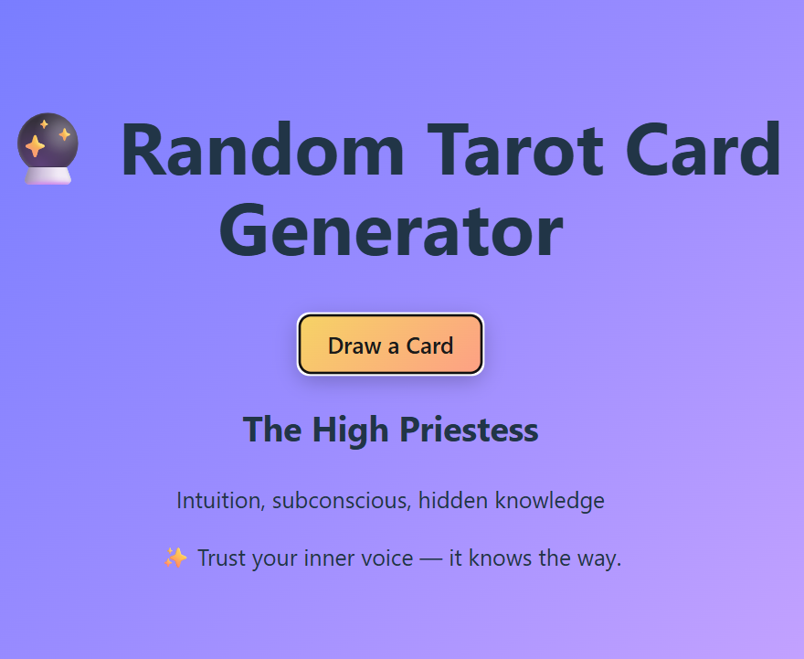

# 🔮 Tarot Card Generator

A simple React mini project that generates random tarot cards with a touch of styling and responsiveness.  
Built as part of my React learning journey.

---

## 🌐 Live Demo  
👉 [View Project](https://the-tarot-knows.netlify.app/)

---

## 📸 Screenshot  

---

## ⚡ Features  
- 🎴 Generates random tarot cards on button click  
- 🎨 Clean UI with warm yellowish theme  
- 📱 Responsive design for desktop and mobile  
- ⚛️ Built with React + Vite  

---

## 🛠️ Tech Stack  
- **React** (Frontend framework)  
- **Vite** (Fast build tool)  
- **CSS3** (Styling, responsiveness)  

---
